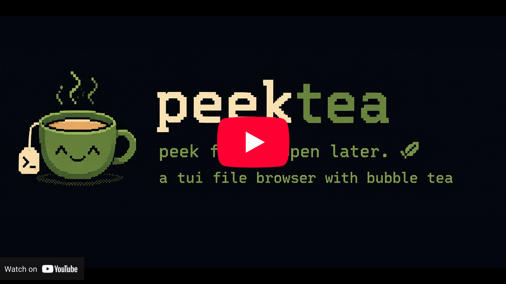
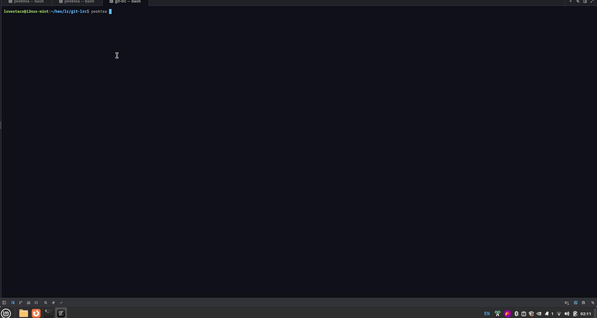
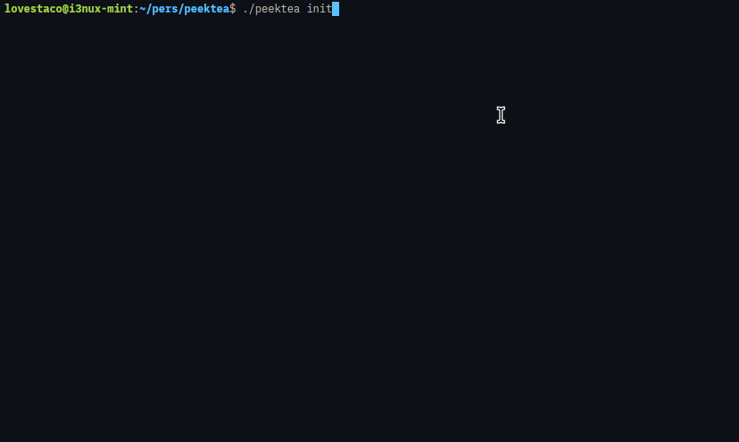
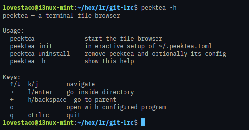

A minimal terminal file browser built with [Bubble Tea](https://github.com/charmbracelet/bubbletea). 

Peek through your filesystem with arrow keys (or vim keys), then pour each file straight into the app you've configured for it.

## Demo

A quick peek before you steep:
Click below to watch the demo on YouTube (7m), or scroll down to see gif (10s)
[](https://www.youtube.com/watch?v=yDNN5x9Y9Ok)
demo in gif version


## Install

**One-liner:**

```bash
curl -fsSL https://raw.githubusercontent.com/lovestaco/peektea/master/scripts/install.sh | sh
```

**Download a binary** (no Go required) — grab the latest release for your platform from the [releases page](https://github.com/lovestaco/peektea/releases/latest):

| Platform | File |
|----------|------|
| Linux x86-64 | `peektea_*_linux_amd64.tar.gz` |
| Linux arm64 | `peektea_*_linux_arm64.tar.gz` |
| macOS x86-64 | `peektea_*_darwin_amd64.tar.gz` |
| macOS Apple Silicon | `peektea_*_darwin_arm64.tar.gz` |

Extract and put the `peektea` binary anywhere on your `$PATH`.

**Install with Go:**

```bash
go install github.com/lovestaco/peektea@latest
```

**Build from source:**

```bash
git clone https://github.com/lovestaco/peektea
cd peektea
make install
```

`make install` puts the binary in `~/go/bin` and figures out `$PATH` for you:

1. Already reachable — done, nothing to do.
2. `~/.local/bin` is on your PATH — symlinks the binary there, works immediately in the current shell.
3. Neither — appends `~/go/bin` to your `.bashrc`/`.zshrc` and tells you which file to `source`.

## Usage

```bash
peektea
```

Starts in the current working directory.

## Keys

| Key | Action |
|-----|--------|
| `↑` / `k` | move up |
| `↓` / `j` | move down |
| `→` / `l` / `enter` | go inside directory |
| `←` / `h` / `backspace` | go to parent |
| `H` | go to home directory |
| `o` | open with configured program |
| `p` | toggle preview panel |
| `[` / `]` | scroll preview up / down |
| `/` | filter entries as you type |
| `esc` | exit filter / clear active filter |
| `.` | toggle hidden files (dotfiles) |
| `s` | cycle sort: name → size → modified |
| `q` / `ctrl+c` | quit |

## Filter

Press `/` to enter filter mode. Type anything and the list narrows to matching entries in real time. The filter input appears at the bottom of the panel above the hint bar — like vim's command line.

- `enter` — confirm and exit filter mode (filter stays active)
- `esc` — clear the filter entirely
- `↑` / `↓` still navigate while you type

Press `.` to toggle hidden files (dotfiles) on and off. The hint bar always shows the current state: `. show hidden` or `. hide hidden`. Both filters compose — you can search by name with dotfiles visible or hidden at the same time.

## Preview

Press `p` to open a side-by-side preview panel. Press `p` again to close it.

- **Text files** — rendered with syntax highlighting via [bat](https://github.com/sharkdp/bat) if installed, plain text otherwise
- **Images** — rendered directly in the terminal via [chafa](https://hpjansson.org/chafa/)
- **Directories** — lists the contents of the folder
- **Binary files** — shows a `[binary file]` notice

Use `[` and `]` to scroll through the preview. Long files load up to 500 lines so you can page through them without leaving the browser.

The left panel auto-widens to fit the longest filename in the current directory. `peektea init` will tell you if chafa is installed and how to get it if not.

## Sort

Press `s` to cycle the sort mode: **name** → **size** (largest first) → **modified** (newest first) → back to name. The current sort is always shown in the hint bar.

## WSL

Works on Windows Subsystem for Linux. peektea detects WSL automatically and routes file opens through `wslview` (from [wslu](https://wslutiliti.es/wslu/)) if available, otherwise `explorer.exe`. Linux paths are converted to Windows paths via `wslpath` so Windows apps can read them.

`peektea init` on WSL skips the Linux GUI app categories and sets the Windows opener as the fallback instead.

## Setup

Run `peektea init` to configure which apps open each file type.

It peeks into your installed software and lets you pick your blend. If there's only one option for a category it selects it automatically. If chafa isn't installed for image previews, init offers to install it on the spot using your system package manager — no copy-pasting commands needed.

Declining the "already exists, overwrite?" prompt keeps your existing config and continues to the chafa check, so you can re-run `peektea init` just to install extras without touching your config.



## Configuration

`init` writes `~/.peektea.toml`, but you can steep it by hand. Each key is derived straight from the file extension — dots become underscores, wrapped with `_` and `_config`:

```
file.md        → _md_config
archive.tar.gz → _tar_gz_config
hello.xd.dd    → _xd_dd_config
directory      → _dir_config
```

Example, brewed to taste:

```toml
_md_config      = "vim"
_png_config     = "feh"
_dir_config     = "nautilus"
_default_config = "less"

terminal_programs = ["vim", "nvim", "nano", "micro", "hx"]
```

Fallback order when opening a file — the bag never comes up empty:

1. The matching `_<ext>_config` key
2. `_default_config` for unknown extensions
3. `vim` if nothing is configured at all

**`terminal_programs`** tells peektea which programs need the full terminal. Anything in this set (vim, nvim, etc.) takes over the screen while open — the whole table, not just a saucer. Everything else (GUI apps like nautilus or feh) launches in the background and keeps the browser brewing.

## Help

```bash
peektea -h
```

Consider it the menu before you order:



## Uninstall

```bash
peektea uninstall
```

For when you've had your fill. 

It shows you exactly what it's about to delete, asks for confirmation, then asks separately whether you also want `~/.peektea.toml` removed. 

No silent nuke — no tea spilled without warning.

## Development

```bash
make build      # build ./peektea
make install    # build and install to ~/go/bin
make start      # live reload via air (rebuilds on every .go save)
make snapshot   # build release archives locally without publishing
make release    # tag + publish a GitHub release via goreleaser
```

Requires [air](https://github.com/air-verse/air) for `make start` (`go install github.com/air-verse/air@latest`).
Requires [goreleaser](https://goreleaser.com) for `make release` / `make snapshot` (`go install github.com/goreleaser/goreleaser/v2@latest`).

## Stack

- [Bubble Tea](https://github.com/charmbracelet/bubbletea) — TUI framework (Elm Architecture)
- [Bubbles](https://github.com/charmbracelet/bubbles) — TUI components (textinput for filter)
- [Lipgloss](https://github.com/charmbracelet/lipgloss) — terminal styling

---

## since you peeked this far — check out what I'm really brewing

I'm Maneshwar, and alongside peektea I'm building [git-lrc](https://github.com/HexmosTech/git-lrc?utm_source=peektea) — a micro AI code reviewer that runs on every commit.

It hooks into `git commit`, reviews every diff before it lands, and catches the bugs AI agents introduce silently. 60-second setup.

AI agents write code fast.

They also silently remove logic, change behavior, and introduce bugs — without telling you.

You often find out in production.

git-lrc fixes this.

Any feedback or contributors are welcome.

⭐ [Star git-lrc on GitHub](https://github.com/HexmosTech/git-lrc?utm_source=peektea) to help other devs discover it.
