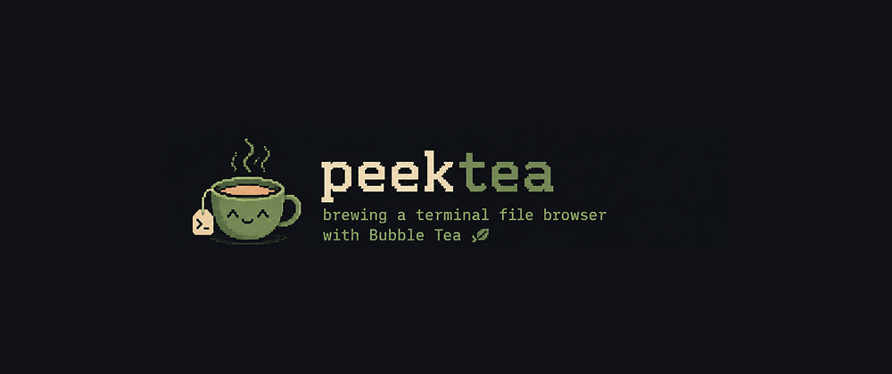

# peektea



A minimal terminal file browser built with [Bubble Tea](https://github.com/charmbracelet/bubbletea). Navigate your filesystem from the terminal using arrow keys (or vim keys).

## Install

```bash
git clone https://github.com/lovestaco/peektea
cd peektea
make install   # puts peektea in ~/go/bin
```

## Usage

```bash
peektea
```

Starts in the current working directory.

## Keys

| Key | Action |
|-----|--------|
| `↑` / `k` | move up |
| `↓` / `j` | move down |
| `→` / `l` / `enter` | open directory |
| `←` / `h` / `backspace` | go to parent |
| `q` / `ctrl+c` | quit |

## Development

```bash
make build   # build ./peektea
make start   # live reload via air (rebuilds on every .go save)
make install # install to ~/go/bin
```

Requires [air](https://github.com/air-verse/air) for `make start` (`go install github.com/air-verse/air@latest`).

## Stack

- [Bubble Tea](https://github.com/charmbracelet/bubbletea) — TUI framework (Elm Architecture)
- [Lipgloss](https://github.com/charmbracelet/lipgloss) — terminal styling
